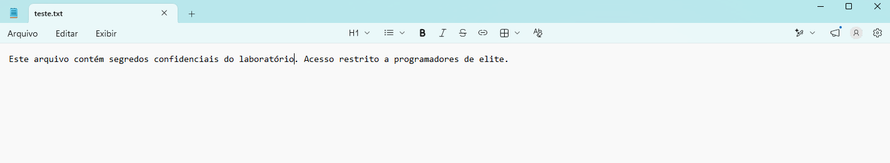
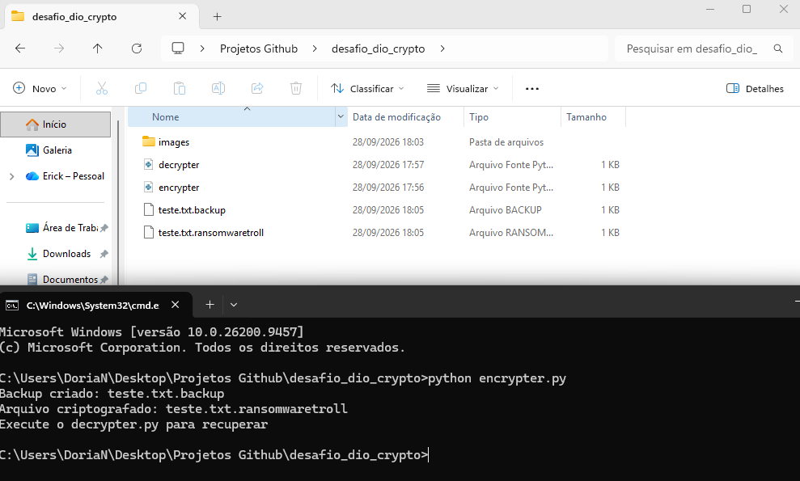
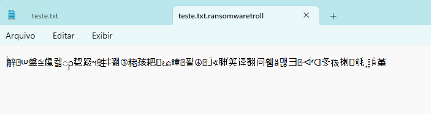
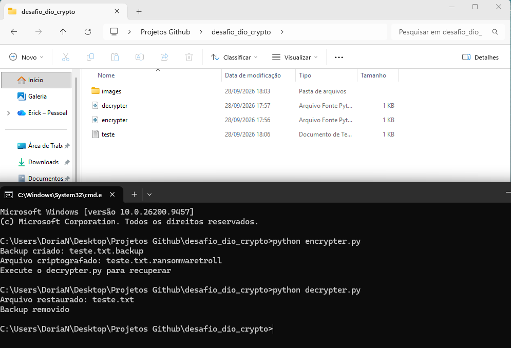

# Desafio DIO - Cibersegurança: Ransomware Educacional

## Objetivo
Implementação educacional demonstrando como funciona a criptografia usada em ransomware, com foco em **aprendizado e defesa**.

## Aviso Importante
Este código é **apenas para fins educacionais**, visando entender o funcionamento de criptografia simétrica e os riscos de ataques. O uso indevido para criptografar dados sem autorização é crime no Brasil (Lei 12.730/2012, LGPD, Código Penal).

## Funcionamento
- **encrypter.py**: Criptografa o arquivo de teste usando AES em modo CTR
- **decrypter.py**: Restaura o arquivo original usando a mesma chave
- Chave utilizada: `b"testeransomwares"` (fixa para demonstração)
- Biblioteca: `pyaes`

## Medidas de Segurança Adotadas
- Execução em pasta isolada
- Backup automático antes da criptografia
- Nenhum dado pessoal incluído
- Código adaptado para aprendizado sem riscos

## Evidências da Execução

### 1. Arquivo modelo a ser criptografado
Teste.txt com uma mensagem secreta:



---

### 2. Criptografia em Execução
Terminal executando o criptografador:



Arquivo criptografado — conteúdo protegido e ilegível:



---

### 3. Descriptografia e Recuperação
Execução do descriptografador:



## Como Usar
```bash
pip install pyaes
python encrypter.py   # Criptografa
python decrypter.py   # Descriptografa
